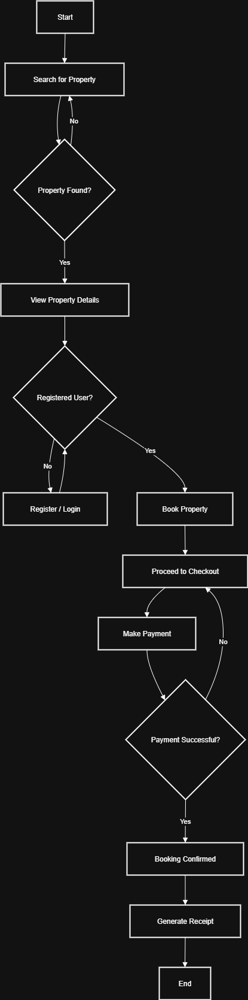

# Requirement Analysis in Software Development

This repository contains the Requirement Analysis assignment for the Booking Management System.  
The goal is to practice documenting, analyzing, and structuring requirements as part of the Software Development Life Cycle (SDLC).
## What is Requirement Analysis?

Requirement Analysis is the process of identifying, gathering, and documenting what a software system needs to do.  
It is one of the first steps in the Software Development Life Cycle (SDLC) and ensures that developers, clients, and end-users all understand the goals of the system.

It helps to:
- Understand user needs clearly.
- Prevent misunderstandings between stakeholders.
- Provide a foundation for design, development, and testing.
## Why is Requirement Analysis Important?

Requirement Analysis is a critical step in the Software Development Life Cycle (SDLC) because:

1. **Clarity of Objectives**  
   It ensures that all stakeholders (clients, developers, and users) have a shared understanding of what the system should achieve.

2. **Prevents Costly Errors**  
   Identifying requirements early reduces the risk of rework, saving time and money during later stages of development.

3. **Improves System Quality**  
   Well-defined requirements create a solid foundation for design, development, and testing, which leads to a reliable and scalable system.
## Key Activities in Requirement Analysis

The Requirement Analysis process involves the following key activities:

- **Requirement Gathering**  
  Collecting information from stakeholders, users, and documents to understand system needs.

- **Requirement Elicitation**  
  Using techniques like interviews, surveys, and workshops to draw out detailed requirements.

- **Requirement Documentation**  
  Writing requirements in a clear and structured way, usually in documents like SRS (Software Requirements Specification).

- **Requirement Analysis and Modeling**  
  Studying the requirements to check feasibility and using models/diagrams to represent them visually.

- **Requirement Validation**  
  Reviewing requirements with stakeholders to confirm they are accurate, complete, and aligned with business goals.
## Types of Requirements

In a Booking Management System, requirements are usually divided into two main categories:

### 1. Functional Requirements
These describe what the system should do — the core features and behaviors.  
Examples:
- Users should be able to **create an account and log in**.
- The system should allow **customers to search and book available rooms**.
- Admins should be able to **manage bookings and update availability**.

### 2. Non-functional Requirements
These describe the quality attributes of the system rather than specific features.  
Examples:
- The system should handle **at least 500 concurrent users** without crashing.  
- The system should provide **confirmation emails within 2 minutes** of booking.  
- The system should ensure **secure login using encryption protocols**.
## Use Case Diagrams

Use Case Diagrams visually show the interaction between users (actors) and the system’s functions (use cases).  
They help clarify requirements and define system boundaries.  

Here is the use case diagram for the Booking Management System:

## Acceptance Criteria

Acceptance Criteria are the predefined conditions that a system or feature must meet to be considered complete and successful.  
They act as a checklist to confirm whether the implemented functionality aligns with business goals and user expectations.  

### Importance of Acceptance Criteria
- Ensure clarity between developers, testers, and stakeholders about what is expected.  
- Prevent scope creep by clearly defining what is "done."  
- Provide measurable outcomes for testing and validation.  
- Improve communication by reducing misunderstandings.  

### Example: Checkout Feature (Booking Management System)
**Feature**: Checkout  

**Acceptance Criteria:**  
- The user must be able to proceed to checkout only if logged in.  
- The checkout page should display booking summary (property details, dates, and total cost).  
- The user must be able to enter or select payment details.  
- The system should integrate with the payment gateway to process payments.  
- On successful payment, the user should receive a booking confirmation message and email.  
- If payment fails, the user should be notified with an error message and prompted to retry.  
